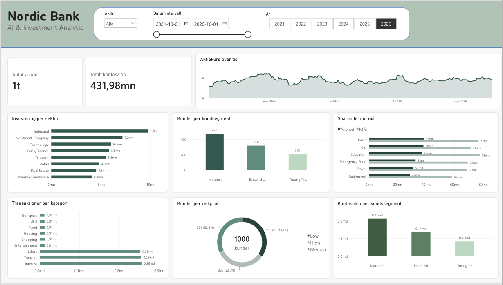

# Nordic Bank – AI & Investment Analytics

## Overview

**Nordic Bank – AI & Investment Analytics** is a fictional banking analytics project that combines data engineering, relational databases, business intelligence, machine learning and generative AI.

The project demonstrates how customer, account, transaction, investment, savings goal and market data can be generated, stored, analyzed and used to support data-driven decision-making.

The project follows an end-to-end data and analytics workflow:

**Python → PostgreSQL → SQL → Excel / Power BI → Machine Learning → AI Assistant**

All banking data is synthetically generated and belongs to the fictional Nordic Bank.

---

## Project Objectives

The project was developed to demonstrate the ability to:

- Design and work with a relational database using PostgreSQL
- Generate and prepare synthetic banking data using Python
- Perform data transformation and ETL
- Analyze data using SQL
- Perform business-oriented analysis using Excel
- Build interactive dashboards using Power BI
- Develop a machine learning model for savings goal risk prediction
- Integrate generative AI with databases and machine learning models
- Build an AI-powered financial assistant using tool calling

---

## Architecture

```
                 Synthetic Banking Data
                          │
                          ▼
                       Python
                 Data Generation / ETL
                          │
                          ▼
                     PostgreSQL
                          │
             ┌────────────┼─────────────┐
             ▼            ▼             ▼
          SQL          Excel        Power BI
       Analysis    Business Analysis  Dashboard
             │
             ▼
       Machine Learning
       Savings Risk Model
             │
             ▼
    AI Financial Assistant
             │
             ▼
          Ollama
             │
             ▼
         Llama 3.2
             │
        Tool Calling
         ┌───┴────┐
         ▼        ▼
   PostgreSQL   ML Model
```

## Database
The PostgreSQL database contains the following main entities:
- Customers
- Accounts
- Transactions
- Investments
- Savings Goals
- Market Data

Primary keys and foreign keys are used to represent relationships between the different entities.

The database acts as the central data source for the project's analysis, machine learning and AI components.

The database structure is defined in:
database/schema.sql

## Data Generation & ETL
Python is used to generate and prepare synthetic banking data.
The project includes scripts for:
- Generating customers
- Generating accounts
- Generating transactions
- Generating investments
- Generating savings goals
- Fetching historical market data
- Preparing machine learning data

The generated data is designed to simulate a realistic banking environment while remaining completely synthetic.

## SQL Analysis
SQL is used to analyze the banking data and answer business-oriented questions, including:
- Customer segments and risk profiles
- Account balances
- Transaction activity
- Investment holdings
- Savings goal progress
- Market data
- Investment performance

The SQL analysis is stored in:
database/analysis.sql

## Excel Analysis
Excel is used as an additional business-oriented analysis layer.
Pivot tables and visualizations are used to analyze:
- Customer segments
- Average income
- Account balances
- Invested capital by sector
- Transaction amounts by category

The Excel analysis provides a more ad-hoc and business-focused view of the underlying banking data.


The complete Excel analysis is available in:
excel/Nordic_Bank_Excel_Analysis.xlsx

## Power BI Dashboard
Power BI is used to create an interactive business intelligence dashboard based on the Nordic Bank data.
The dashboard includes:
- Number of customers
- Total account balance
- Stock price development over time
- Investment value by sector
- Customers by customer segment
- Savings progress
- Transactions by category
- Customer risk profile distribution
- Account balance by customer segment



The complete Power BI report is available in:
powerbi/Nordic_Bank_Dashboard.pbix

## Machine Learning
A machine learning model is used to estimate the probability that a customer will reach their savings goal.

The model uses features such as:
- Income
- Age
- Target amount
- Current savings
- Savings progress
- Remaining amount
- Required monthly saving
- Days to target
- Customer segment
- Risk profile

A logistic regression model is trained using synthetic data.

The trained model is stored in:
ai/savings_model.pkl

The model is a proof-of-concept trained on synthetic data and should not be interpreted as a validated banking risk model.

## AI Financial Assistant
The project includes a local AI-powered financial assistant using:
- Ollama
- Llama 3.2
- Python
- PostgreSQL
- Machine learning tools

The assistant uses tool calling to retrieve and analyze information from the PostgreSQL database and machine learning model.

Examples of questions the assistant can answer:
- What is the income of customer 50?
- What transactions does customer 50 have?
- What investments does customer 50 have?
- Analyze all savings goals for customer 80.
- Which savings goals have the highest risk of not being reached?
- What is the total and average investment value for each risk profile?
- Which customer segment has the highest total investment value?
- What are the key insights from the Nordic Bank customer data?

The assistant selects the appropriate tool based on the user's question and returns the result in natural language.

The AI assistant is implemented in:
ai/llm_assistant.py

## Technologies
Data & Backend
- Python
- PostgreSQL
- SQL
- Pandas
- NumPy
Machine Learning
- Scikit-learn
- Joblib
Financial Data
- yfinance
Business Intelligence
- Microsoft Excel
- Power BI
- DAX
Generative AI
- Ollama
- Llama 3.2

## Project Structure
```
Nordic-Bank-AI-Investment-Analytics/
│
├── ai/
│   ├── database_connection.py
│   ├── llm_assistant.py
│   ├── predict_savings_risk.py
│   ├── train_savings_model.py
│   └── savings_model.pkl
│
├── data/
│   └── generated/
│       └── savings_ml_dataset.csv
│
├── database/
│   ├── analysis.sql
│   └── schema.sql
│
├── excel/
│   ├── excel_dashboard.png
│   └── Nordic_Bank_Excel_Analysis.xlsx
│
├── powerbi/
│   ├── powerbi_dashboard.png
│   └── Nordic_Bank_Dashboard.pbix
│
├── src/
│   ├── fetch_market_data.py
│   ├── generate_accounts.py
│   ├── generate_customers.py
│   ├── generate_investments.py
│   ├── generate_savings_goals.py
│   ├── generate_transactions.py
│   └── prepare_ml_data.py
│
├── .gitignore
├── README.md
└── requirements.txt
```

How to Run
1. Create the PostgreSQL database
Create a PostgreSQL database called:
nordic_bank

2. Create the database schema
Run:
database/schema.sql

3. Install Python dependencies
Create and activate a virtual environment and install the required packages:
pip install -r requirements.txt

4. Generate the synthetic data
Run the relevant Python scripts in src/ to generate:
- Customers
- Accounts
- Investments
- Savings Goals
- Transactions

5. Load the data into PostgreSQL
Load the generated data into the corresponding PostgreSQL tables.
Market data is retrieved using:
src/fetch_market_data.py

6. Prepare the machine learning data
python src/prepare_ml_data.py

7. Train the machine learning model
python ai/train_savings_model.py

8. Run the AI assistant
Start Ollama with the required local model and run:
python ai/llm_assistant.py

## Limitations
- All banking data is synthetic.
- Nordic Bank is a fictional organization.
- The savings risk model is a proof-of-concept trained on synthetic data.
- The machine learning model has not been validated using real banking data.
- The AI assistant only has access to information provided by its available tools.
- The project is intended for educational and portfolio purposes and should not be used for real financial decision-making.

## Disclaimer
This project is a fictional portfolio project created to demonstrate technical and analytical capabilities.

No real customer data, financial records or confidential banking information are used.